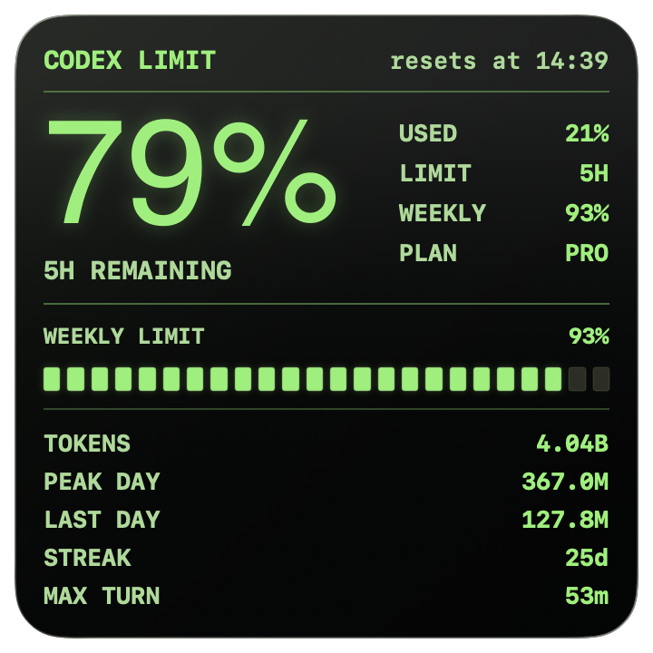
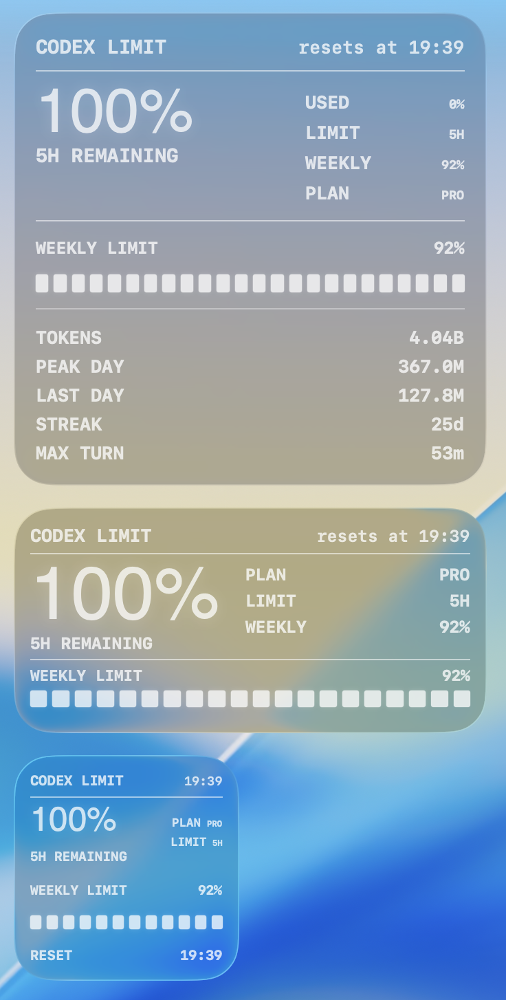
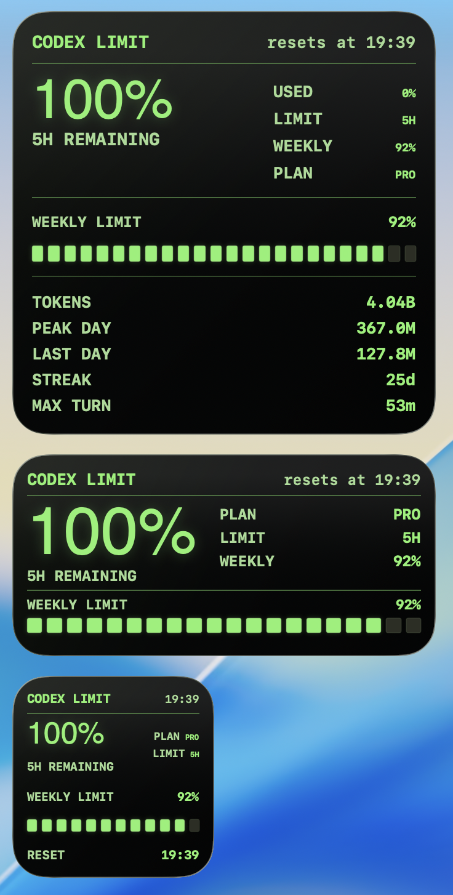
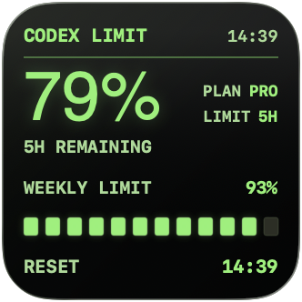
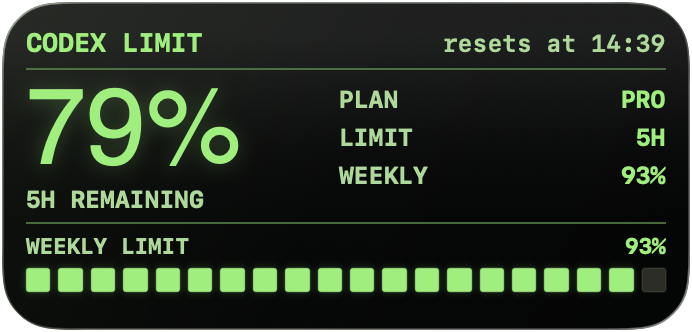
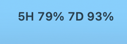
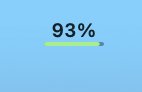
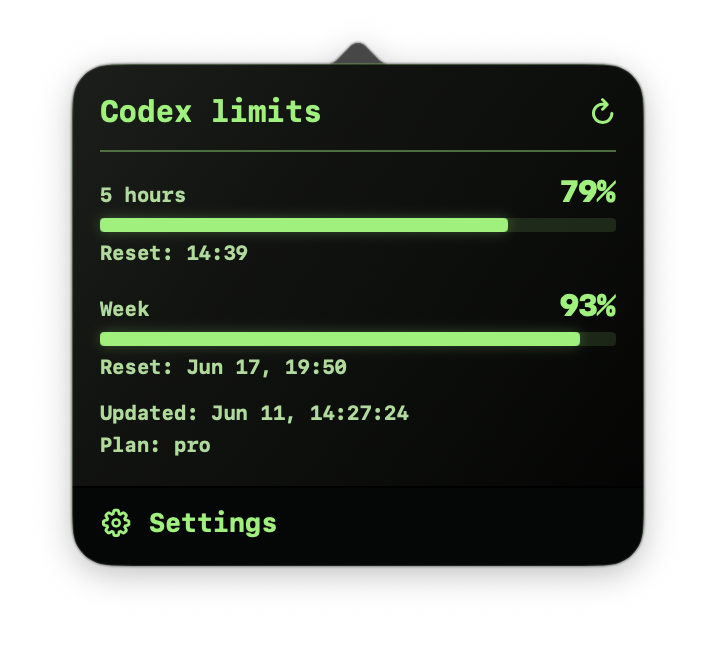
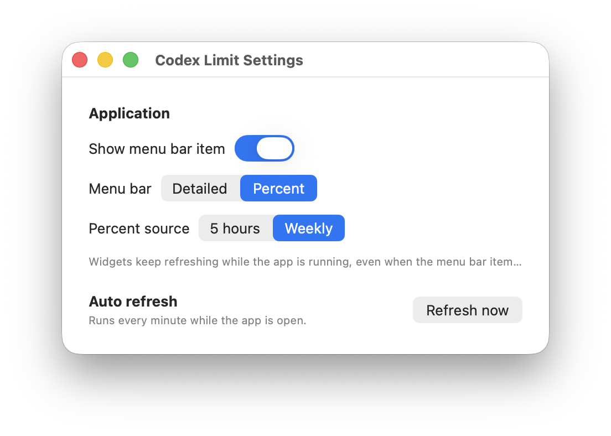

# Codex Limit Widget

Codex Limit Widget is a small macOS menu bar app and WidgetKit widget for tracking your Codex subscription limits.

It shows the remaining 5-hour and weekly Codex quota, reset time, plan, and account usage stats without keeping the Codex desktop app open.



## What It Shows

- 5-hour Codex limit remaining.
- Weekly Codex limit remaining.
- Exact reset time for the current 5-hour window.
- Weekly progress meter.
- Plan type, for example `PRO` or `PLUS`.
- Account usage stats such as total tokens, peak day, last day, streak, and max turn.
- Optional menu bar status in either detailed or compact percent mode.

## Install

Download `CodexLimitWidget-1.0.2-macOS.dmg` from the latest GitHub Release, open it, and run:

```sh
./install.command
```

The installer copies `Codex Limit Widget.app` to `/Applications`, removes old `Codex Limit.app` and `CodexLimitWidget.app` builds if they exist, registers the app with LaunchServices, and starts it. The release also includes a zip archive for manual installs.

The app runs as a menu bar/background app and does not stay in the Dock.

### Requirements

- macOS 14 or newer.
- Xcode is only required if you build from source.
- Codex CLI must be installed and authenticated.

Codex Limit Widget reads data through:

```sh
codex app-server --stdio
```

If the Codex CLI is missing or logged out, the widget can still show the last cached snapshot, but it cannot refresh live data.

## Screenshots

### Desktop Widgets

Small, medium, and large widgets are designed for quick scanning on the desktop.










### Menu Bar

Detailed mode shows both quota windows:



Percent mode shows one selected source with a small live meter:



Clicking the menu bar item opens the popover:



### Settings

Settings let you hide the menu bar item, choose the menu bar mode, choose the percent source, and refresh manually.



## How It Works

Codex Limit Widget starts the local Codex app-server over stdio and sends JSON-RPC requests:

```json
{"jsonrpc":"2.0","id":2,"method":"account/rateLimits/read","params":null}
{"jsonrpc":"2.0","id":3,"method":"account/usage/read","params":null}
```

The app uses the `codex` limit bucket:

- `primary` is treated as the 5-hour window.
- `secondary` is treated as the weekly window.
- `planType` is shown as the current plan.
- `resetsAt` is converted to local reset time.

The menu bar app refreshes every minute and writes a cached snapshot into shared storage. The WidgetKit extension reads that cached snapshot and reloads its timeline.

The Codex app-server connection is treated as unreliable I/O. Each JSON-RPC response wait has a bounded timeout, stdout is read asynchronously, and a stalled child process is terminated off the main app path so one bad refresh cannot permanently block later updates.

This means:

- The Codex desktop app does not need to be open.
- The Codex CLI must remain installed and authenticated.
- Widgets can keep showing the last good value if refresh fails.

## Build From Source

```sh
git clone https://github.com/sergeylopukhov/codex-limit-widget.git
cd codex-limit-widget
./build-install-run.command
```

The build script compiles the release build, installs it to `/Applications/Codex Limit Widget.app`, ad-hoc signs it locally, registers it, and launches it.

To create release files locally:

```sh
./scripts/make-release.command
```

The release files are written to:

```text
release/CodexLimitWidget-1.0.2-macOS.dmg
release/CodexLimitWidget-1.0.2-macOS.zip
```

## Signing Notice

The included release workflow creates an ad-hoc signed app. For fully silent installation on every Mac, the release must be signed with an Apple Developer ID certificate and notarized by Apple.

Without Developer ID notarization, macOS Gatekeeper may show a warning depending on how the archive was downloaded and opened. The install script removes quarantine from the installed app, but it cannot replace Apple notarization.

## Privacy

Codex Limit Widget does not send data to its own server. It only talks to the local Codex CLI app-server and stores a small local JSON snapshot for the widget.
