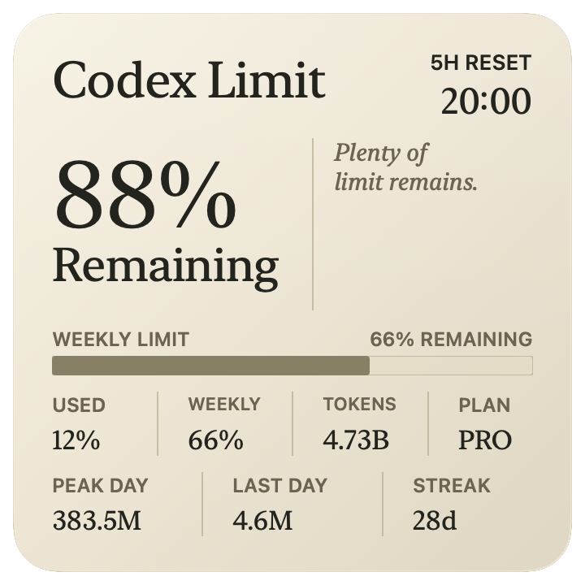
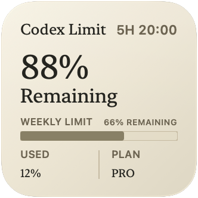
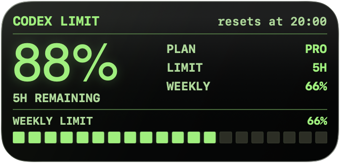
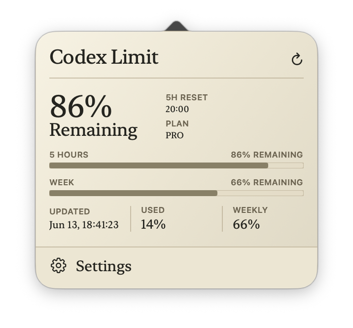
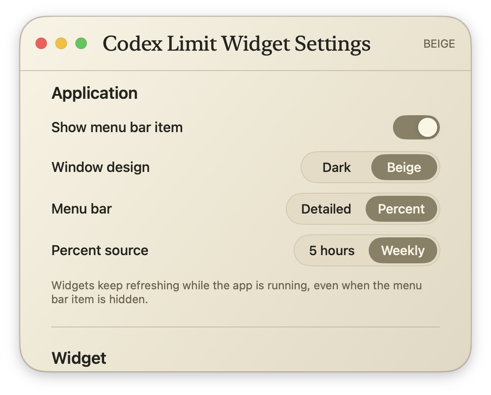
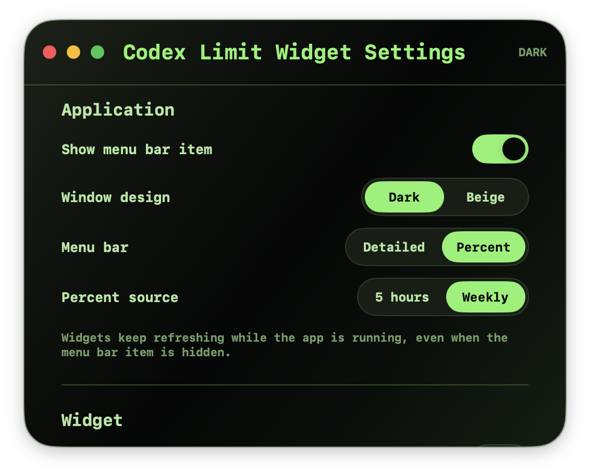

# Codex Limit Widget

<div align="center">
  

  <p>
    A macOS menu bar app and WidgetKit widget for keeping Codex quota visible at a glance.
  </p>

  <p>
    <a href="https://github.com/sergeylopukhov/codex-limit-widget/releases/latest"></a>
    
    
  </p>
</div>

Codex Limit Widget shows your remaining 5-hour and weekly Codex limits, reset times, plan, and usage stats without keeping the Codex desktop app open. It runs quietly in the menu bar, refreshes in the background, and gives desktop widgets the latest cached snapshot.

## Highlights

<table>
  <tr>
    <td width="33%">
      <strong>Live Codex limits</strong><br>
      Track 5-hour and weekly quota with exact reset times.
    </td>
    <td width="33%">
      <strong>Desktop widgets</strong><br>
      Small, medium, and large WidgetKit layouts in two visual styles.
    </td>
    <td width="33%">
      <strong>Menu bar control</strong><br>
      Detailed or compact percent modes with a quick popover.
    </td>
  </tr>
  <tr>
    <td width="33%">
      <strong>Usage context</strong><br>
      Plan, total tokens, peak day, last day, streak, and max turn.
    </td>
    <td width="33%">
      <strong>Cached fallback</strong><br>
      Widgets keep showing the last good snapshot if refresh fails.
    </td>
    <td width="33%">
      <strong>Local first</strong><br>
      Data is read from the local Codex CLI app-server.
    </td>
  </tr>
</table>

## Widgets

### Editorial

Warm, readable widgets for desktop glanceability.

<table>
  <tr>
    <td width="40%" align="center">
      <br>
      <sub>Large</sub>
    </td>
    <td width="38%" align="center">
      <br>
      <sub>Medium</sub>
    </td>
    <td width="22%" align="center">
      <br>
      <sub>Small</sub>
    </td>
  </tr>
</table>

### Terminal

High-contrast terminal widgets for a dense developer setup.

<table>
  <tr>
    <td width="40%" align="center">
      <br>
      <sub>Large</sub>
    </td>
    <td width="38%" align="center">
      <br>
      <sub>Medium</sub>
    </td>
    <td width="22%" align="center">
      <br>
      <sub>Small</sub>
    </td>
  </tr>
</table>

## Menu Bar

The menu bar app can show a detailed text status or a compact percent meter. Clicking it opens a popover with both limit windows, reset times, freshness, and quick access to settings.

<table>
  <tr>
    <td width="50%" align="center">
      <br>
      <sub>Beige popover</sub>
    </td>
    <td width="50%" align="center">
      <br>
      <sub>Dark popover</sub>
    </td>
  </tr>
</table>

## Settings

Choose the window theme, menu bar mode, and percent source. Widgets keep refreshing while the app is running, even when the menu bar item is hidden.

<table>
  <tr>
    <td width="50%" align="center">
      <br>
      <sub>Beige settings</sub>
    </td>
    <td width="50%" align="center">
      <br>
      <sub>Dark settings</sub>
    </td>
  </tr>
</table>

## Install

Download the latest `.dmg` from [GitHub Releases](https://github.com/sergeylopukhov/codex-limit-widget/releases/latest), open it, and drag `Codex Limit Widget.app` to `Applications`.

The release also includes a `.zip` archive for manual installs. The app runs as a menu bar/background app and does not stay in the Dock.

### Requirements

- macOS 14 or newer.
- Codex CLI installed and authenticated.
- Xcode is only required if you build from source.

## How It Works

Codex Limit Widget starts the local Codex app-server over stdio:

```sh
codex app-server --stdio
```

It reads:

```json
{"jsonrpc":"2.0","id":2,"method":"account/rateLimits/read","params":null}
{"jsonrpc":"2.0","id":3,"method":"account/usage/read","params":null}
```

The app treats the `codex` limit bucket as follows:

- `primary`: the 5-hour window.
- `secondary`: the weekly window.
- `planType`: the current plan.
- `resetsAt`: local reset time.

The menu bar app refreshes periodically and writes a cached snapshot into shared storage. WidgetKit reads that snapshot and reloads timelines from it. If Codex CLI is unavailable or logged out, widgets can keep showing the last successful snapshot, but live refresh will fail until Codex is available again.

## Build From Source

```sh
git clone https://github.com/sergeylopukhov/codex-limit-widget.git
cd codex-limit-widget
./build-install-run.command
```

The build script compiles the release build, installs it to `/Applications/Codex Limit Widget.app`, ad-hoc signs it locally, registers it, and launches it.

To create release files locally:

```sh
./scripts/make-release.command
```

The release files are written to:

```text
release/CodexLimitWidget-<version>-macOS.dmg
release/CodexLimitWidget-<version>-macOS.zip
```

## Uninstall

Quit Codex Limit Widget and delete the app from Applications:

```text
/Applications/Codex Limit Widget.app
```

If the widget still appears in the widget gallery after deleting the app and restarting your Mac, another local copy of the app or widget extension is still registered. Search for remaining copies:

```sh
mdfind 'kMDItemFSName == "Codex Limit Widget.app" || kMDItemFSName == "CodexLimitWidgetExtension.appex"'
```

After removing the paths printed by that command, restart your Mac. macOS can keep WidgetKit extensions in its local cache while any copy of the app or `.appex` still exists on disk.

## Privacy

Codex Limit Widget does not send data to its own server. It talks to the local Codex CLI app-server and stores a small local JSON snapshot for widgets.

## Signing

The included release workflow creates an ad-hoc signed app. For fully silent installation on every Mac, the release must be signed with an Apple Developer ID certificate and notarized by Apple.

Without Developer ID notarization, macOS Gatekeeper may show a warning depending on how the archive was downloaded and opened.
