# Codex Limit Widget

  <a href="README.md"><strong>English</strong></a> · <a href="README.ru.md">Русский</a>

  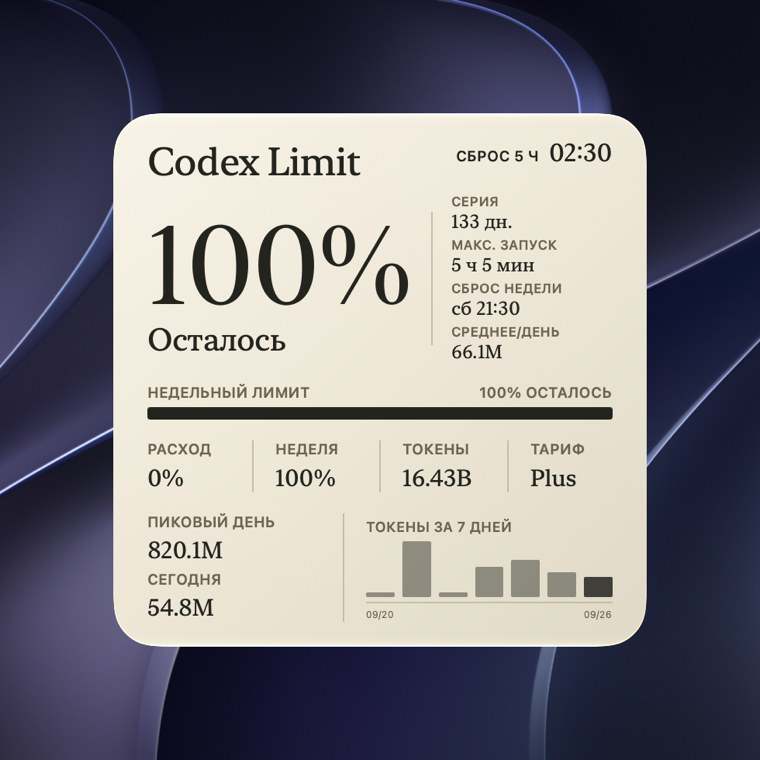

  

    A macOS menu bar app and desktop widget for keeping Codex limits visible.
  

  

    
    
    
  

Codex Limit Widget puts your Codex limits in the macOS menu bar and on the desktop, so you can see how much is left without opening Codex. It shows whichever limit windows your account has: weekly-only accounts get just the weekly limit, with no empty 5-hour slot, and accounts that still have the 5-hour window get both. Reset times, your plan, and usage history are always one glance away.

While the app is running, it refreshes the data once a minute and hands the latest snapshot to WidgetKit.

## What It Shows

- Every limit window your account has: weekly, plus 5-hour when Codex reports it.
- When each limit resets.
- Your Codex plan under a readable name, such as `Plus`, `Pro 5x`, or `Pro 20x`.
- Usage stats: lifetime tokens, peak day, tokens used today, current streak, longest turn, and daily average.
- A seven-day token chart in the large widget.
- A compact percent or a detailed readout in the menu bar, with a meter that shifts from green to dark red as the limit runs down.
- A note when the data is more than a few minutes old, and the time of the last successful sync.
- One widget in Small, Medium, and Large sizes.
- Dark and Beige designs, or System to follow the macOS appearance.
- English or Russian interface, or the system language.
- A notice and an `Update now` button when a new release is out.

## Install

1. Download the latest `.dmg` from [GitHub Releases](https://github.com/sergeylopukhov/codex-limit-widget/releases/latest).
2. Open it and drag `Codex Limit Widget.app` to `Applications`.
3. Launch the app.

Once installed, the app updates itself (version 1.1.8 and later).

Requirements:

- macOS 14 or later.
- Codex CLI. If it's missing or you're not signed in, the app offers to install it and start sign-in.

Codex in the ChatGPT desktop app doesn't replace the CLI here: the app reads limits through the local Codex CLI. With your confirmation, it can run the official CLI installer for you.

## Add The Widget

Open the macOS widget gallery, find `Codex Limit Widget`, and pick Small, Medium, or Large.

The widget uses the design selected in the app's settings, and widgets already on the desktop switch as soon as you change it. When a window covers the desktop, macOS turns the widget into system glass in either design.

## Menu Bar

The menu bar item shows either a compact percent or a detailed readout. In percent mode, a thin meter under the number fills with the remaining limit and shifts from green to dark red as it runs out. The digits can take the same color. Both are separate switches in Settings: the meter is colored by default, the digits aren't.

  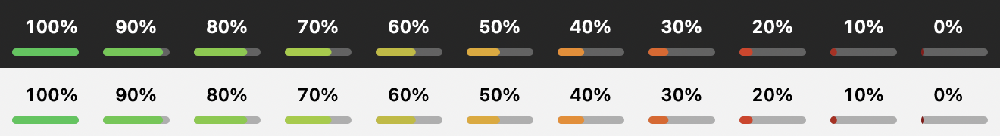

Left-click and right-click each get their own action: the context menu, the popover, Settings, or Codex. The context menu refreshes limits, copies the current status, and quits the app.

The popover shows each limit window with a colored meter, reset times, and your plan, plus a `Copy status` button that copies the plan, percentage, and reset time of each window as plain text. When an update is ready, an arrow appears next to the menu bar value and the popover shows an update card.

<table>
  <tr>
    <td width="50%" align="center">
      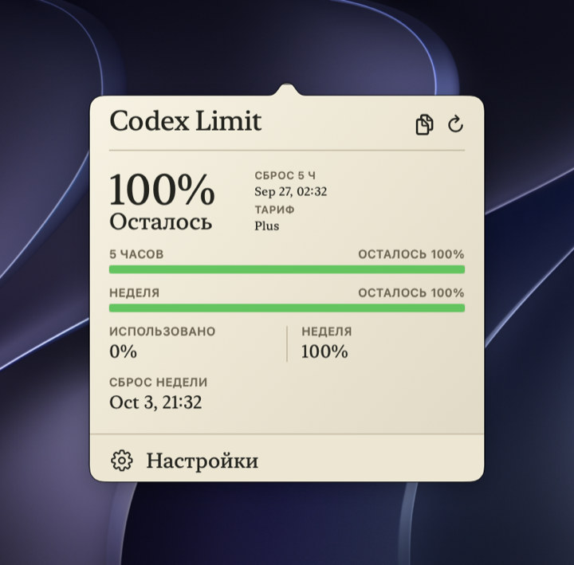 
      Beige
    </td>
    <td width="50%" align="center">
      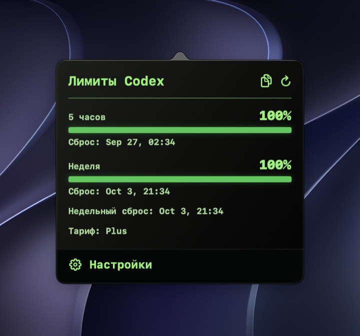 
      Dark
    </td>
  </tr>
</table>

A global keyboard shortcut, set in Settings, opens a larger window with both limits and your usage stats from any app. Press it again to close the window.

## Widgets

<table>
  <tr>
    <td width="40%" align="center">
       
      Large
    </td>
    <td width="38%" align="center">
      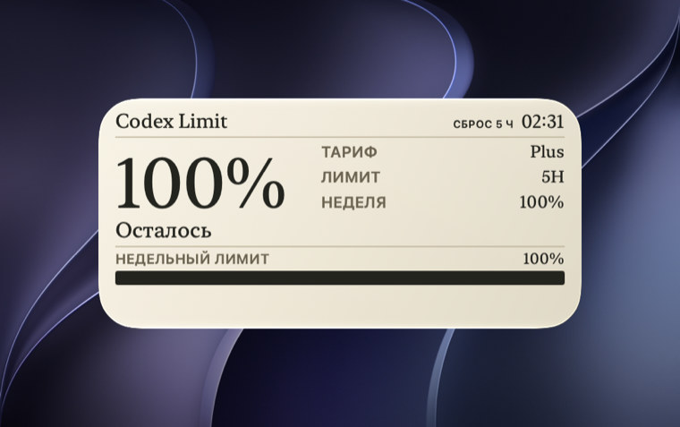 
      Medium
    </td>
    <td width="22%" align="center">
      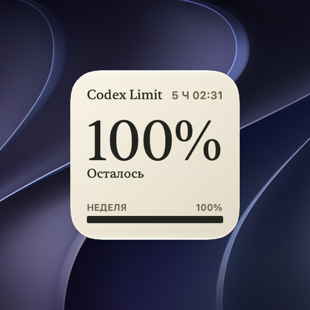 
      Small
    </td>
  </tr>
</table>

<table>
  <tr>
    <td width="40%" align="center">
      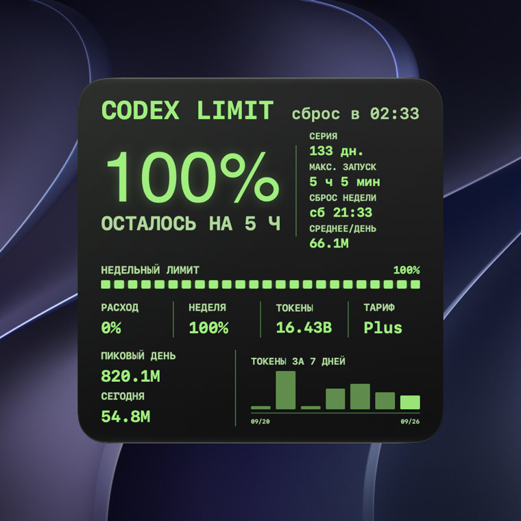 
      Large
    </td>
    <td width="38%" align="center">
      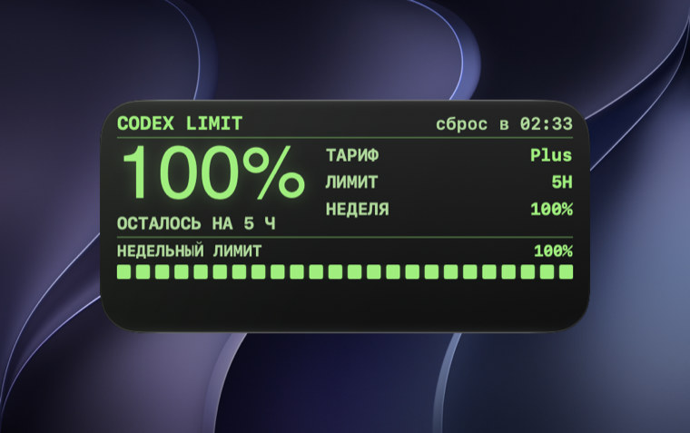 
      Medium
    </td>
    <td width="22%" align="center">
      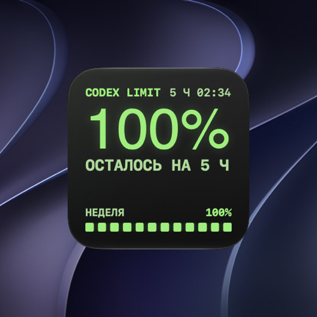 
      Small
    </td>
  </tr>
</table>

A click on the widget opens the app, the detailed limits window, or Codex, whichever you choose in Settings. The line with the last sync time can be turned off there too.

## Settings

Settings are organized into tabs:

- **General**: design (Dark, Beige, or System), language, and the keyboard shortcut for the detailed limits window.
- **Menu bar**: show or hide the item, percent or detailed mode, colored meter and digits, which limit feeds the percent, and the left-click and right-click actions.
- **Widgets**: the last sync time line and what a click on the widget opens.
- **Notifications**: low-limit alerts with separate thresholds for each limit, and quiet hours.
- **Updates**: installed version, result of the last check, and the update button.
- **Diagnostics**: Codex CLI status, data source, last successful sync, the CLI response when a refresh fails, and `Reset data`.

`Reset data` asks for confirmation, then deletes the stored limit snapshot, widget data, notification history, and app settings. Your Codex account and CLI sign-in stay untouched.

<table>
  <tr>
    <td width="50%" align="center">
      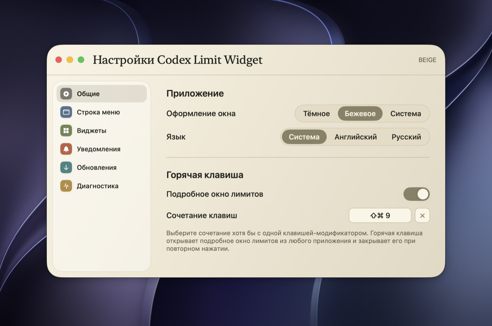 
      Beige
    </td>
    <td width="50%" align="center">
      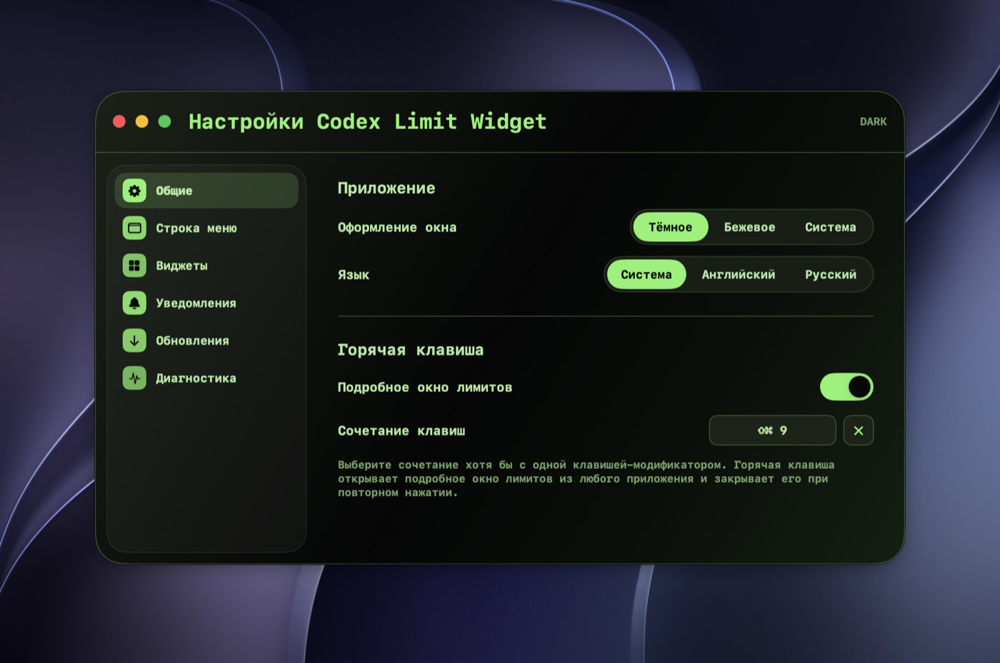 
      Dark
    </td>
  </tr>
</table>

## Notifications

The 5-hour and weekly limits each have their own switch and thresholds, so you decide when each one warns you. Quiet hours silence low-limit alerts during the hours you pick; they don't affect the restored-limit message.

You only get a restored-limit notification for a limit the app actually saw run out: it has to record the window at 100% used and still be running when the quota comes back. It also needs notification permission, which the app asks for once.

## Updates

The app checks the latest public GitHub release at launch and every four hours after that. You can also check manually in Settings.

When a new version is out, the menu bar, the popover, and Settings all say so. Press `Update now` and the app downloads the official macOS ZIP, verifies its SHA-256 digest published by GitHub, bundle identifier, version, and code signature, replaces the copy in `Applications`, and relaunches. After the update, `What's New` lists what changed since the version you had.

If the app can't write to `Applications`, use `Open release page` and install the DMG by hand.

## Privacy

Your Codex usage and limit data never leave your Mac. The app reads the local Codex CLI session and keeps a small snapshot for the widget. Update checks send only the installed version number to the public GitHub Releases API, never usage data. The project has no server of its own.

## Uninstall

Quit Codex Limit Widget and delete it from `Applications`.

If the widget is still there afterwards, restart your Mac and remove any other copies of `Codex Limit Widget.app`.
