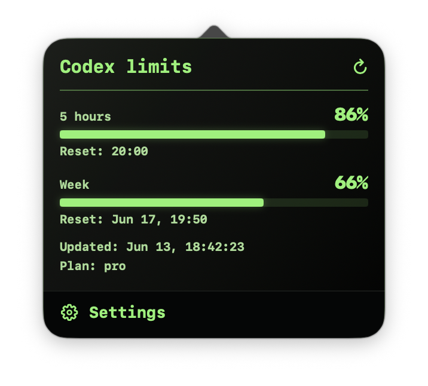
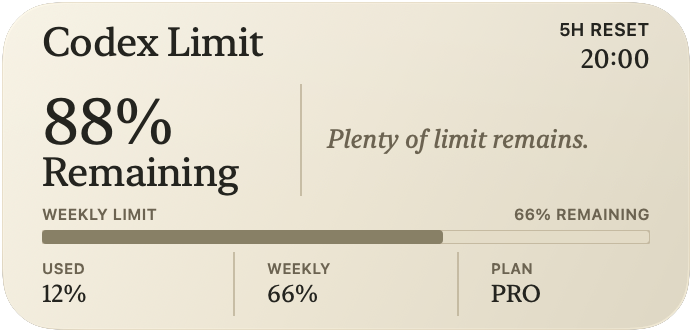
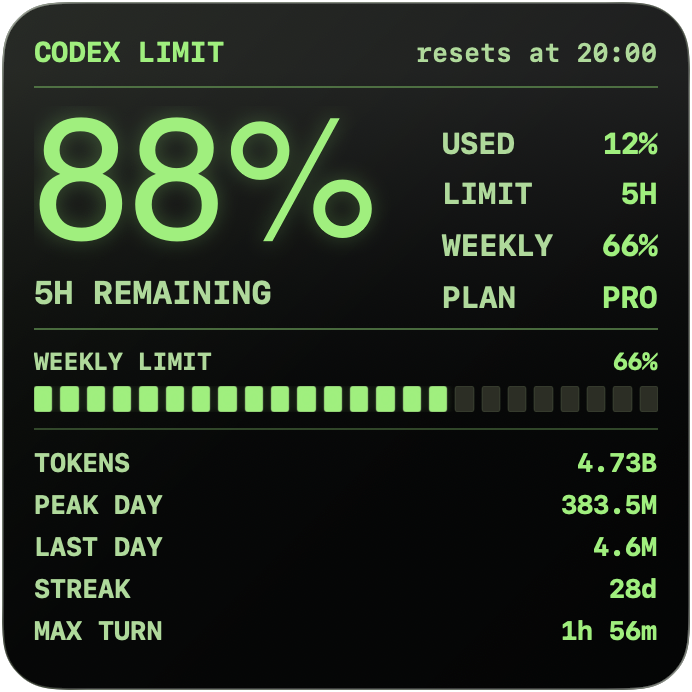
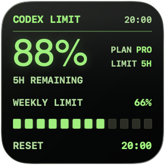

# Codex Limit Widget

  <a href="README.md">English</a> · <a href="README.ru.md"><strong>Русский</strong></a>

  

  

    Приложение для строки меню macOS и виджет рабочего стола, чтобы видеть лимиты Codex.
  

  

    
    
    
  

Codex Limit Widget — приложение для строки меню macOS и виджет рабочего стола. Оно показывает остаток 5-часового и недельного лимитов Codex, время сброса, план и статистику использования. Codex Desktop держать открытым не нужно: приложение обновляет данные в фоне и передаёт их виджету macOS.

## Что показывает

- Остаток 5-часового и недельного лимитов.
- Время сброса каждого лимита.
- Текущий план Codex.
- Статистику использования: токены, день с наибольшим расходом, последний день, серию дней и самый долгий запрос.
- Компактный или подробный индикатор в строке меню.
- Виджет macOS в размерах Small, Medium и Large.
- Два оформления: Dark и Beige.

## Установка

1. Скачайте последнюю версию `.dmg` в [GitHub Releases](https://github.com/sergeylopukhov/codex-limit-widget/releases/latest).
2. Откройте файл и перетащите `Codex Limit Widget.app` в `Applications`.
3. Запустите приложение.

Требования:

- macOS 14 или новее.
- Установленный и авторизованный Codex CLI.

## Как добавить виджет

Откройте галерею виджетов macOS, найдите `Codex Limit Widget` и выберите размер: Small, Medium или Large.

Оформление меняется в настройках приложения. Выберите `Dark` или `Beige`; уже добавленные виджеты обновятся, пока приложение запущено.

## Строка меню

Индикатор в строке меню может показывать подробные лимиты или компактный процент. Нажмите на него, чтобы открыть окно с лимитами, временем сброса, свежестью данных и настройками.

<table>
  <tr>
    <td width="50%" align="center">
       
      Beige
    </td>
    <td width="50%" align="center">
       
      Dark
    </td>
  </tr>
</table>

## Виджеты

<table>
  <tr>
    <td width="40%" align="center">
       
      Large
    </td>
    <td width="38%" align="center">
       
      Medium
    </td>
    <td width="22%" align="center">
       
      Small
    </td>
  </tr>
</table>

<table>
  <tr>
    <td width="40%" align="center">
       
      Large
    </td>
    <td width="38%" align="center">
       
      Medium
    </td>
    <td width="22%" align="center">
       
      Small
    </td>
  </tr>
</table>

## Настройки

В настройках можно выбрать оформление окна, режим строки меню и источник процента.

<table>
  <tr>
    <td width="50%" align="center">
       
      Beige
    </td>
    <td width="50%" align="center">
       
      Dark
    </td>
  </tr>
</table>

## Приватность

Codex Limit Widget читает данные из локальной сессии Codex CLI и хранит небольшой локальный снимок для виджетов. На свой сервер приложение ничего не отправляет.

## Удаление

Завершите Codex Limit Widget и удалите приложение из папки `Applications`.

Если после удаления виджет всё ещё виден в галерее, перезагрузите Mac и удалите другие локальные копии `Codex Limit Widget.app`.
